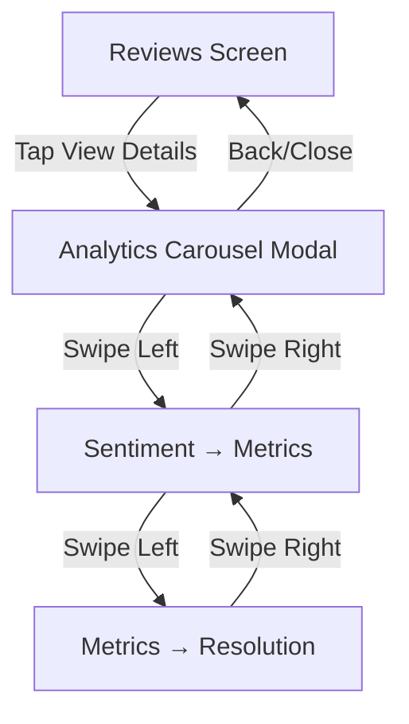

# Design Document: Review Analytics Carousel

## Overview

This design implements a horizontal carousel containing three analytics visualization screens within the Review section of the React Native Expo application. The carousel is triggered by a "View Details" button and provides users with sentiment analysis, performance metrics, and resolution status visualizations.

The implementation leverages existing patterns from the codebase, including the carousel implementation in `reviews.tsx` using `react-native-gesture-handler` and `react-native-reanimated`. The design reuses shared components (ThemedView, ThemedText) and maintains visual consistency with the existing color scheme (#F67D2C primary, #FFFFFF background).

### Key Design Decisions

1. **Modal Presentation**: The analytics carousel will be presented as a full-screen modal overlay rather than navigation to maintain context and allow easy dismissal
2. **Chart Library**: Use `react-native-svg` with custom implementations for donut charts and horizontal bars to maintain bundle size and styling control
3. **Gesture Handling**: Reuse the existing PanGestureHandler pattern from the main reviews carousel for consistency
4. **Component Reusability**: Extract shared header, search bar, and pagination components to avoid duplication
5. **Data Flow**: Pass product data through modal props, with mock data structure matching the existing ProductCard interface

## Architecture

### Component Hierarchy

```
ReviewsScreen (existing)
├── ViewDetailsButton (new)
└── AnalyticsCarouselModal (new)
    ├── SharedHeader (extracted)
    ├── SharedSearchBar (extracted)
    ├── CarouselContainer (new)
    │   ├── SentimentDistributionScreen (new)
    │   │   ├── DonutChart (new)
    │   │   └── ThemeTagsList (new)
    │   ├── FiveMetricScorecardScreen (new)
    │   │   └── MetricBar (new)
    │   └── ResolutionLensScreen (new)
    │       └── ResolutionStatusCard (new)
    ├── PaginationIndicator (extracted)
    └── SharedBottomNavigation (existing from _layout.tsx)
```

### File Structure

```
components/
├── analytics/
│   ├── AnalyticsCarouselModal.tsx       # Main modal container
│   ├── SentimentDistributionScreen.tsx  # Screen 1
│   ├── FiveMetricScorecardScreen.tsx    # Screen 2
│   ├── ResolutionLensScreen.tsx         # Screen 3
│   ├── DonutChart.tsx                   # Donut chart visualization
│   ├── MetricBar.tsx                    # Horizontal bar component
│   └── PaginationIndicator.tsx          # Dot indicators
├── shared/
│   ├── ReviewHeader.tsx                 # Extracted header
│   └── ReviewSearchBar.tsx              # Extracted search bar
app/(tabs)/
└── reviews.tsx                          # Modified to add View Details button
```

### Navigation Flow



## Components and Interfaces

### AnalyticsCarouselModal

**Purpose**: Main container component that manages the carousel state and gesture handling

**Props**:
```typescript
interface AnalyticsCarouselModalProps {
  visible: boolean;
  onClose: () => void;
  productData: ProductAnalyticsData;
}

interface ProductAnalyticsData {
  productId: number;
  productName: string;
  productSubtitle: string;
  sentiment: SentimentData;
  metrics: MetricsData;
  resolution: ResolutionData;
}
```

**State**:
- `currentScreenIndex: number` - Tracks active screen (0-2)
- `translateX: Animated.SharedValue<number>` - Horizontal scroll position

**Key Methods**:
- `handleSwipeGesture()` - Processes pan gesture events
- `navigateToScreen(index: number)` - Programmatic navigation
- `handleClose()` - Dismisses modal and resets state

### SentimentDistributionScreen

**Purpose**: Displays sentiment analysis with donut chart and theme breakdowns

**Props**:
```typescript
interface SentimentDistributionScreenProps {
  data: SentimentData;
}

interface SentimentData {
  positive: number;    // Percentage
  neutral: number;     // Percentage
  negative: number;    // Percentage
  topPositiveThemes: string[];
  topNeutralThemes: string[];
  topNegativeThemes: string[];
}
```

**Layout**:
- Header (shared component)
- Search bar (shared component)
- Donut chart (centered, 200x200)
- Three theme sections (vertical stack)
- Pagination indicator
- Bottom navigation (shared)

### FiveMetricScorecardScreen

**Purpose**: Displays five company rating metrics with horizontal bar visualizations

**Props**:
```typescript
interface FiveMetricScorecardScreenProps {
  data: MetricsData;
}

interface MetricsData {
  transparency: number;        // 0-5 rating
  responsiveness: number;      // 0-5 rating
  easeOfProcess: number;       // 0-5 rating
  trustworthiness: number;     // 0-5 rating
  overallSatisfaction: number; // 0-5 rating
}
```

**Layout**:
- Header (shared component)
- Search bar (shared component)
- Five metric rows (vertical stack)
- Each row: label, score, horizontal bar
- Pagination indicator
- Bottom navigation (shared)

### ResolutionLensScreen

**Purpose**: Displays review resolution status percentages

**Props**:
```typescript
interface ResolutionLensScreenProps {
  data: ResolutionData;
}

interface ResolutionData {
  resolved: number;      // Percentage
  inProgress: number;    // Percentage
  unresolved: number;    // Percentage
}
```

**Layout**:
- Header (shared component)
- Search bar (shared component)
- Three status cards (vertical stack)
- Disclaimer note
- Pagination indicator
- Bottom navigation (shared)

### DonutChart

**Purpose**: Renders a donut chart using react-native-svg

**Props**:
```typescript
interface DonutChartProps {
  data: {
    positive: number;
    neutral: number;
    negative: number;
  };
  size?: number;           // Default: 200
  strokeWidth?: number;    // Default: 30
}
```

**Implementation**:
- Uses SVG Circle elements with stroke-dasharray for segments
- Color mapping: positive (#4CAF50), neutral (#FFC107), negative (#F44336)
- Center text shows total percentage
- Segments calculated using circumference math

### MetricBar

**Purpose**: Renders a horizontal bar visualization for metric scores

**Props**:
```typescript
interface MetricBarProps {
  label: string;
  score: number;        // 0-5 rating
  maxScore?: number;    // Default: 5
  color?: string;       // Default: #F67D2C
}
```

**Implementation**:
- Container: full width, height 60
- Label: left-aligned text
- Score: right-aligned, formatted to 1 decimal
- Bar: horizontal progress indicator
- Fill percentage: (score / maxScore) * 100

### PaginationIndicator

**Purpose**: Displays dot indicators for carousel position

**Props**:
```typescript
interface PaginationIndicatorProps {
  totalScreens: number;
  currentIndex: number;
  dotColor?: string;        // Default: #E5E5E5
  activeDotColor?: string;  // Default: #F67D2C
}
```

**Implementation**:
- Horizontal row of circular dots
- Active dot: width 24, height 8, pill shape
- Inactive dots: width 8, height 8, circular
- Spacing: 8px between dots

### Shared Components

**ReviewHeader**:
```typescript
interface ReviewHeaderProps {
  title: string;
  onProfilePress?: () => void;
}
```

**ReviewSearchBar**:
```typescript
interface ReviewSearchBarProps {
  searchQuery: string;
  onSearchChange: (query: string) => void;
  onFilterPress: () => void;
  selectedSort: string;
  onSortChange: (sort: string) => void;
}
```

## Data Models

### Complete Data Structure

```typescript
// Main product analytics data
interface ProductAnalyticsData {
  productId: number;
  productName: string;
  productSubtitle: string;
  sentiment: SentimentData;
  metrics: MetricsData;
  resolution: ResolutionData;
}

// Sentiment analysis data
interface SentimentData {
  positive: number;              // Percentage (0-100)
  neutral: number;               // Percentage (0-100)
  negative: number;              // Percentage (0-100)
  topPositiveThemes: string[];   // Array of theme tags
  topNeutralThemes: string[];    // Array of theme tags
  topNegativeThemes: string[];   // Array of theme tags
}

// Performance metrics data
interface MetricsData {
  transparency: number;          // Rating (0-5)
  responsiveness: number;        // Rating (0-5)
  easeOfProcess: number;         // Rating (0-5)
  trustworthiness: number;       // Rating (0-5)
  overallSatisfaction: number;   // Rating (0-5)
}

// Resolution status data
interface ResolutionData {
  resolved: number;              // Percentage (0-100)
  inProgress: number;            // Percentage (0-100)
  unresolved: number;            // Percentage (0-100)
}

// Modal state
interface AnalyticsModalState {
  visible: boolean;
  productData: ProductAnalyticsData | null;
}
```

### Mock Data Example

```typescript
const mockAnalyticsData: ProductAnalyticsData = {
  productId: 1,
  productName: 'HDFC Large Cap Fund',
  productSubtitle: 'Growth - Direct Plan',
  sentiment: {
    positive: 45,
    neutral: 30,
    negative: 25,
    topPositiveThemes: ['Finance', 'Energy', 'Banking'],
    topNeutralThemes: ['Technology', 'Healthcare', 'Retail'],
    topNegativeThemes: ['Finance', 'Energy', 'Banking'],
  },
  metrics: {
    transparency: 4.2,
    responsiveness: 3.8,
    easeOfProcess: 4.5,
    trustworthiness: 4.1,
    overallSatisfaction: 4.3,
  },
  resolution: {
    resolved: 65,
    inProgress: 20,
    unresolved: 15,
  },
};
```

### Data Validation Rules

1. **Sentiment Percentages**: Must sum to 100
2. **Metric Scores**: Must be between 0 and 5
3. **Resolution Percentages**: Must sum to 100
4. **Theme Arrays**: Maximum 3 items per category
5. **Decimal Formatting**: Metrics displayed to 1 decimal place

